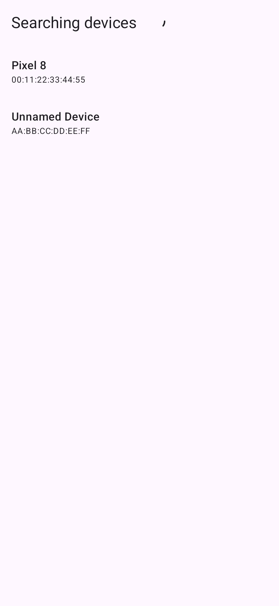
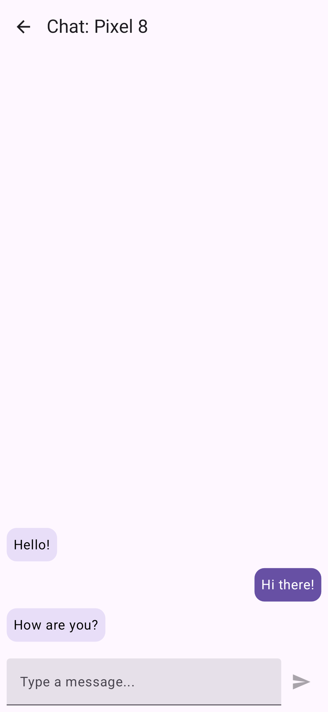

# CMPBluetoothChat

A cross-platform Bluetooth chat application built with **Kotlin Multiplatform** and **Compose Multiplatform**. It allows users to scan for nearby devices and exchange messages over Bluetooth Low Energy (BLE).

## 🚀 Features

- **Device Discovery**: Scan for nearby Bluetooth devices.
- **Real-time Chat**: Exchange text messages over a BLE connection.
- **Cross-Platform**: Shared UI and logic across Android and iOS.

## 📱 Screenshots

| Device Discovery | Real-time Chat |
| :---: | :---: |
|  |  |

## 🛠 Tech Stack

- **[Kotlin Multiplatform](https://kotlinlang.org/docs/multiplatform.html)**: Shared business logic and infrastructure.
- **[Compose Multiplatform](https://www.jetbrains.com/lp/compose-multiplatform/)**: Declarative UI shared between Android and iOS.
- **[Blue Falcon](https://github.com/Reedyuk/blue-falcon)**: Multiplatform Bluetooth Low Energy library.
- **[Koin](https://insert-koin.io/)**: Pragmatic lightweight dependency injection.
- **[Kermit](https://github.com/touchlab/Kermit)**: Kotlin Multiplatform logging utility.

## 📂 Project Structure

- **`:core`**: Contains the core BLE implementation, data sources, and shared domain models.
- **`:features:listdevices`**: Feature module for scanning and listing available Bluetooth devices.
- **`:features:chat`**: Feature module for the messaging UI and logic.
- **`:androidApp`**: Android-specific entry point and configuration.
- **`:iosApp`**: iOS-specific entry point (SwiftUI) and configuration.
- **`:shared`**: Placeholder for other shared UI components or resources.

## 🔐 Permissions

The app requires Bluetooth permissions to function correctly:

### Android
Requires `BLUETOOTH_SCAN`, `BLUETOOTH_ADVERTISE`, `BLUETOOTH_CONNECT`, and `ACCESS_FINE_LOCATION` (depending on the API level). These are declared in `androidApp/src/main/AndroidManifest.xml`.

### iOS
Requires `NSBluetoothAlwaysUsageDescription` and `NSBluetoothPeripheralUsageDescription` in `iosApp/iosApp/Info.plist`.

## 🏃 Getting Started

### Prerequisites
- Android Studio (latest stable version)
- Xcode (for iOS development)

### Running the Apps
- **Android**: Run the `:androidApp` configuration from Android Studio.
- **iOS**: 
    1. Open `iosApp/iosApp.xcodeproj` in Xcode.
    2. Select a simulator or a physical device and press **Run**.

## 🧪 Testing

- **Common Logic**: Run `./gradlew :core:test`
- **Android**: Run `./gradlew :androidApp:connectedAndroidTest`
